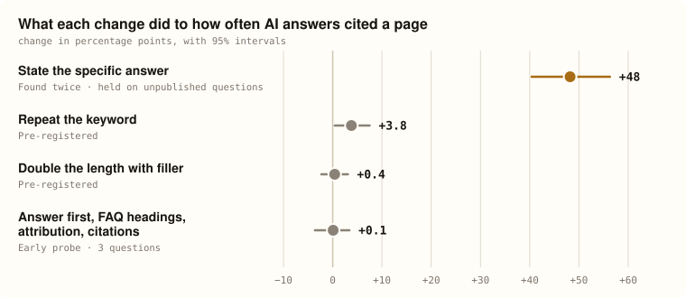

# OpenGEO

**Most advice on getting cited by AI has never been tested. OpenGEO tests it.** It is an
open, reproducible experiment: change one thing about a page, ask AI answer engines the same
question many times, and measure whether they cite the page more.

<picture>
  <source media="(prefers-color-scheme: dark)" srcset="docs/assets/effects-dark.svg">
  
</picture>

**What it found, in plain words.** Every figure, with its interval, is on the
[overview page](docs/index.html), and in full on the [findings page](docs/findings.html).

- **Stating the specific answer** got pages cited far more often than talking around it.
  It is the strongest result here, and it held on questions that have never been published.
  How big the gain is depends on your competition.
- **Repeating your keyword** helped a little. Pre-registered.
- **Padding a page** with filler did nothing, and on some engines it cost citations.
  Pre-registered.
- **Answer-first order, FAQ headings, attribution and source citations** moved nothing we
  could detect. That is early evidence, from a small probe.

**Where it stops.** It measures the synthesis stage: what an engine does once it has your
page, not whether it finds your page in the first place. Documents are handed to each
engine, so retrieval is held constant by construction. That is what makes a result causal,
and it is also its limit; the caveat travels with every number the project publishes.

**Why it is different.** Everything is **reproducible**: the corpus, the harness and every
raw model response ship with each result, so anyone can re-run a round and check it. Every
result is **causal**: a paired design where only the page under test changes, not an
observational comparison of pages that already rank. And it is deliberately **not** a
brand-visibility tracker; it will never ship a composite "visibility score."

## Test your own page

Did your change to your page make AI engines more likely to cite it — against your actual
competitors? `opengeo test` runs the same paired, controlled experiment as every published
round, on your content:

```bash
export OPENROUTER_API_KEY=sk-or-...
python3 opengeo.py test \
    --question "How much does a home energy audit cost?" \
    --page     https://mysite.com/energy-audit \
    --edit     ./energy-audit-v2.md \
    --against  https://competitor-a.com/audits https://competitor-b.com/pricing
```

You get the change in citation rate with a 95% interval, per engine, a chart, and every raw
model response. About $0.30 per question at current prices. Add `--dry-run` to see the
checks and the estimated cost without sending anything.

The rigour is in the defaults, so you don't have to know it to benefit from it: 24 runs per
version, temperature 1.0, randomised document order, a check that your page has room to
improve before paying to test the edit, and a flag when your edited page hits the ceiling.
Each default and the evidence behind it is in `design/opengeo-test.md`.

It is a measurement, not advice. It tells you what your change did; it never tells you what
to change. And it measures what happens once an engine *has* your page — not whether an
engine finds it.

Prefer to ask in plain English? The Claude skill in `.claude/skills/opengeo/` gathers your
page, your question and your competitors, shows you the cost, runs the test and explains the
result: *"Test whether adding our prices to our water heater page helps us get cited."*

## Findings

The current results live in one place, generated from a ledger so they can't drift:

- **`docs/index.html`** — the overview: what was tested, what moved citation, how sure we
  are and where it stops, in plain language. Served by GitHub Pages once this repo is public.
- **`docs/findings.html`** — every finding in full, with per-engine charts and intervals.
- **`results/published/`** — the full report for each round, including the nulls.
- **`results/findings.json`** — the machine-readable ledger both pages are built from.

No figures are written into this README on purpose: every number in the project has exactly
one source, and duplicating them here is how documentation starts lying.

## Quick start

```bash
python3 corpus/build_corpus.py                   # regenerate the corpus + balance checks
python3 run_pilot.py --dry-run                   # cost estimate, no API calls

export OPENROUTER_API_KEY=sk-or-...
python3 run_pilot.py                             # the real thing; --resume after any interruption
python3 analyze.py --runs results/runs.jsonl
```

Verify the analysis before spending anything — `make_mock.py` plants known effects that
`analyze.py` must recover:

```bash
python3 make_mock.py
python3 analyze.py --runs results/mock.jsonl
```

Python 3.9+. The runner is standard library only; `numpy` is used for analysis.

## What's in here

| Path | What it is |
|---|---|
| `METHODOLOGY.md` | The standard: two-tier design, the metric set, sampling and statistics, corpus construction rules, provenance schema |
| `ROADMAP.md` | Open work, completed rounds, positioning, kill criteria |
| `CLAUDE.md` / `AGENTS.md` | Rules for coding agents working in the repo (`AGENTS.md` is a symlink) |
| `corpus/` | Document text lives in the builders; the JSON corpora are generated and hashed |
| `preregistrations/` | One file per round, committed **before** collection. The git timestamp is the evidence |
| `results/` | Raw responses, the findings ledger, and published reports |
| `docs/` | The generated public pages: the overview (`index.html`) and the findings (`findings.html`) |
| `run_pilot.py` | Tier 1 runner: resumable, logs full provenance per call |
| `analyze.py` | Metrics and hypothesis tests — permutation and bootstrap only |
| `judge_fidelity.py`, `fidelity_baseline.py` | Group C fidelity judging and its baseline |
| `calibration_api.py`, `calibration_prompts.py` | Calibration study, API plane |
| `build_findings.py`, `build_story.py` | Build both public pages, and the chart above, from the ledger (`design/story-page.md`) |
| `size_round1.py`, `make_mock.py`, `check_variants.py`, `engine_weights.py` | Power sizing, synthetic validation, corpus checks, engine panel |
| `opengeo.py` | `opengeo test`: run a paired experiment on your own page against your competitors (`design/opengeo-test.md`) |
| `CONTRIBUTING.md` | How to reproduce a round, the rules that are not negotiable, and what adding a round requires |
| `check_private.py` | Leak check for the held-out private split — must pass before any publication (`METHODOLOGY.md` §10.1) |

## How a round works

1. **Build a corpus** and hash it. Document text lives in the builder, never in the JSON.
2. **Pre-register** — hypotheses, corpus hash, models, runs per cell, primary metric,
   analysis plan, stopping rule — and commit it before collecting anything.
3. **Spot check** a few hundred calls to confirm the baseline isn't at a ceiling or floor.
   This is a go/no-go gate on the design, never a peek at the result.
4. **Run it** to completion. No interim analysis.
5. **Analyse and publish**, whichever direction it went, then add the round to
   `results/findings.json` and rebuild the page:

```bash
python3 build_findings.py --check                # validate the ledger
python3 build_findings.py                        # regenerate both pages and the README chart
```

The build refuses to publish a claim the data no longer supports, a round that carries
interim numbers, or a finding citing a report that doesn't exist.

`METHODOLOGY.md` §5.3 and §9 explain why each of those steps is there — all of them come
from a round that went wrong first.

## Where things moved

The docs were consolidated in September 2026. Older pre-registrations and reports cite the
previous locations:

| Cited as | Now |
|---|---|
| `METRICS.md` (Groups A–E, A1, B2, C1…) | `METHODOLOGY.md` §4 — IDs unchanged |
| `METHODOLOGY.md` §0 (positioning) | `ROADMAP.md` — "Why this project exists" |
| `METHODOLOGY.md` §9 (build sequence) | `ROADMAP.md` — "Open work" and "Completed" |
| `METHODOLOGY.md` §10 (risks, kill criteria) | `ROADMAP.md` — "The bear case", "Kill criteria" |
| `CLAUDE.md` "Current state" | `ROADMAP.md` — "Completed", plus the linked records |
| `ROADMAP.md` items 5b, 6 (corpus failure modes) | `METHODOLOGY.md` §9 |

`METHODOLOGY.md` §1–§8 keep their numbering, so every other section citation still resolves.

## Licence and citation

Code MIT (`LICENSE`). Data and results CC BY 4.0 (`LICENSE-DATA`) — cite the numbers,
quote them, build on them, with attribution.

Corpus documents are excerpts of US federal works, which carry no US copyright
(17 U.S.C. § 105); each records its agency, source URL and rights basis.

`CITATION.cff` has the preferred citation. When you are quoting a specific number, cite
the round's dated report under `results/published/`, not just the repository — the
repository changes, a published round does not.
